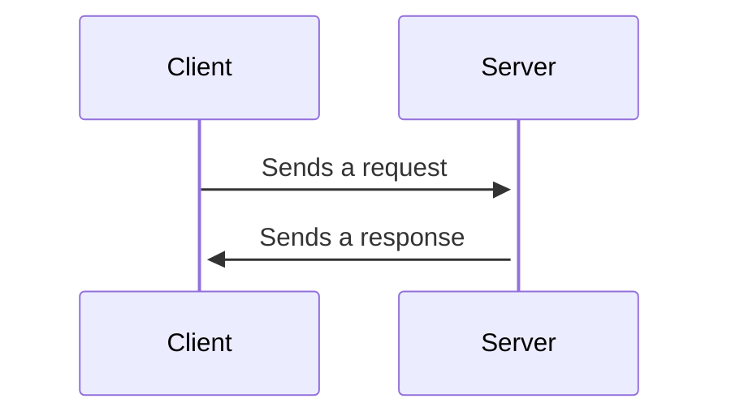

# Backend Engineering Notes

## Contents

- [Backend Engineering Notes](#backend-engineering-notes)
  - [Contents](#contents)
  - [(Some) Backend Communication Design Patterns](#some-backend-communication-design-patterns)
    - [Request Response Model](#request-response-model)

## (Some) Backend Communication Design Patterns

### Request Response Model

This is the most common backend design pattern.

The basic outline is:
1. Client sends a request to the server.
2. Server parses the request.
3. Server processes the request.
4. Server sends a response.
5. Client parses the response and consumes it.

