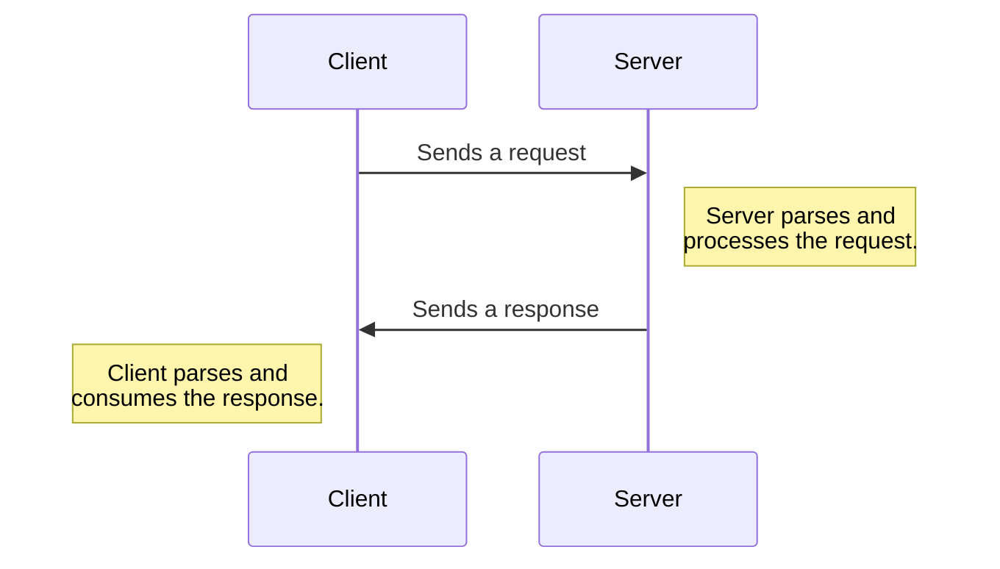
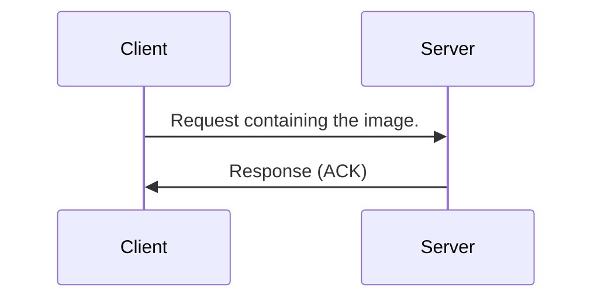
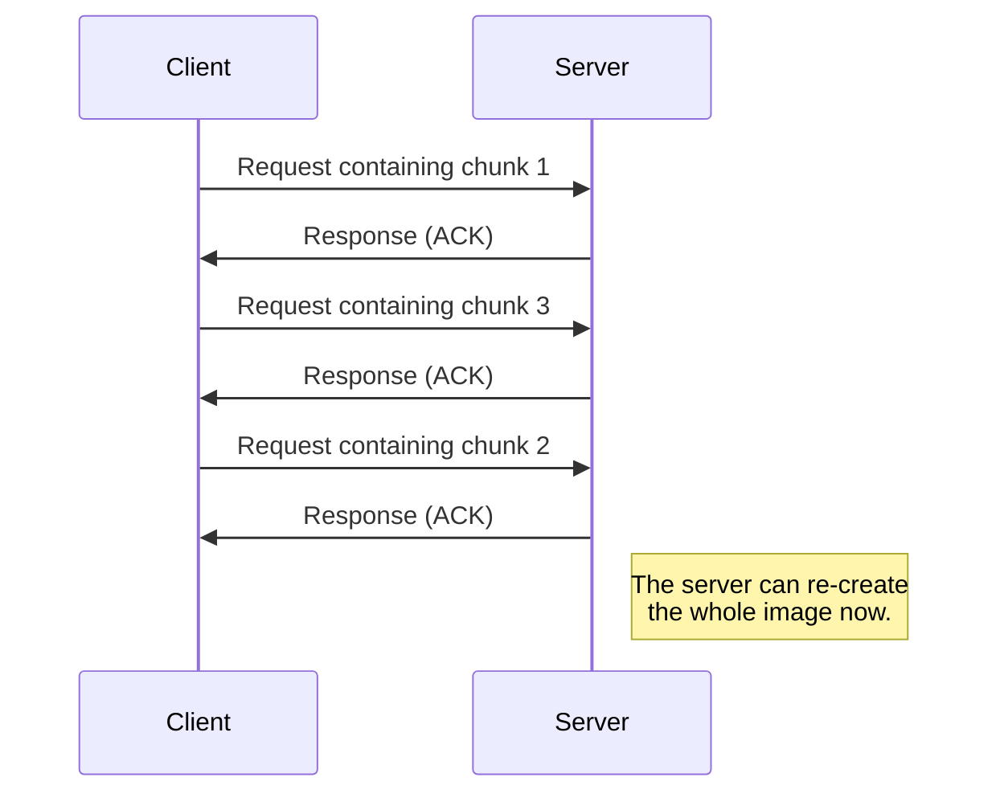
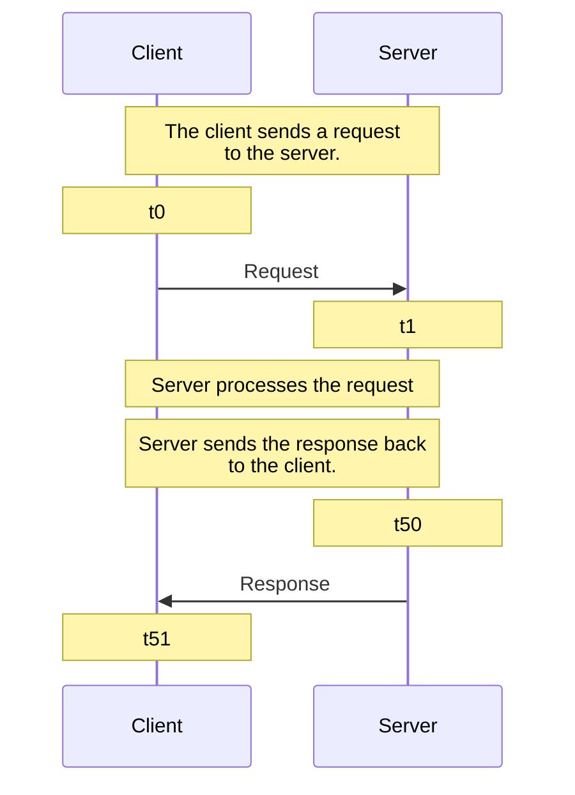

# Backend Engineering Notes

## Contents

- [Backend Engineering Notes](#backend-engineering-notes)
  - [Contents](#contents)
  - [(Some) Backend Communication Design Patterns](#some-backend-communication-design-patterns)
    - [Request Response Model](#request-response-model)
      - [Anatomy of Request/Response](#anatomy-of-requestresponse)
      - [Usecase: Building an Upload Image Service with Request Response](#usecase-building-an-upload-image-service-with-request-response)
      - [This Model Doesn't Work Everywhere!](#this-model-doesnt-work-everywhere)
      - [Summary](#summary)
    - [Synchronous vs Asynchronous Workloads](#synchronous-vs-asynchronous-workloads)
      - [Synchronous I/O](#synchronous-io)
      - [Asynchronous I/O](#asynchronous-io)

## (Some) Backend Communication Design Patterns

### Request Response Model

This is the most common backend design pattern.

The basic outline is:

1. Client sends a request to the server.
2. Server parses the request.
3. Server processes the request.
4. Server sends a response.
5. Client parses the response and consumes it.



This model is used all across the web. Protocols such as HTTP, DNS and SSH are based on it. RPC (remote procedure call) uses this model. SQL is written keeping the request response model in mind. APIs (REST, SOAP, GraphQL) are based on this model.

#### Anatomy of Request/Response

A request structure is defined, and agreed upon by both the client and the server.

A request has a clear boundary (where the bit stream corresponding to the request begins, and where it ends).

Clearly, a request is defined by a protocol and a message format.

A possible structure is an HTTP `GET` request:

```
GET / HTTP/1.1
Headers
<CRLF>
BODY
```

This will be determined when the client and the server decide upon a protocol to use. The request body will be parsed by some library, such as the `http` package available in multiple languages.

Same applies to the response.

#### Usecase: Building an Upload Image Service with Request Response

We have various ways of creating a service that can allow clients to upload images:

1. Client sends a large request with the image. This is simple, but in case the connection fails in between, all previous sent data will be lost.



2. Client divides the image into different chunks, and then sends each chunk in a different request. This allows for resumable sending of image (i.e., server can request specific chunks instead of the whole image in case the connection failed).



#### This Model Doesn't Work Everywhere!

Although the request response model is a popularly used model, some cases exist where use of this model would not produce optimal results.

1. Notification service (e.g., is there any new sale?)
2. Chatting application (e.g., are there new messages?)

In both of these, the server cannot send a 'response' unless the client requests the server for it. A way of building a chatting application using this model might require the client to poll a server repeatedly to check if there are any new messages. This will place a lot of unnecessary (empty) requests on the network. Therefore, this method doesn't scale well.

3. Very long running requests (e.g., query a billion rows in a DB)

Such requests can be handled via this model, but the client will have to wait for a long time before the response arrives here. An asynchronous model might be better suited for this case.
Also, if the client disconnects while the request is running, upon reconnection the client might want to know the status of the request.

#### Summary

The basic method of operation is the following:



At time `t0`, the client has _finished_ serializing the request and flushing it to the network. At time `t1`, the server has parsed the request (not deserialized it yet; that will happen next).

Now, uptill time `t50` the server processes the request, generates the response, serializes it _and_ flushes it to the network.

The client receives the response at time `t51`.

### Synchronous vs Asynchronous Workloads

The basic idea is that whether extra useful work can be done while our system waits for some processing to be done.

#### Synchronous I/O

The caller sends a request and blocks.

The calling process's context is switched out of the CPU while the I/O operation takes place. The caller cannot execute any code meanwhile.

Once the receiver responds, the caller unblocks and execution can continue.

Effectively, the caller and the receiver are in sync.

As an example, consider that a program asks OS to read from the disk. The main thread of the program will be taken off the CPU while the disk is read. Once the read completes, the program can continue execution.

#### Asynchronous I/O

