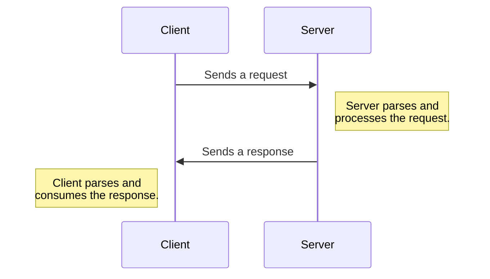
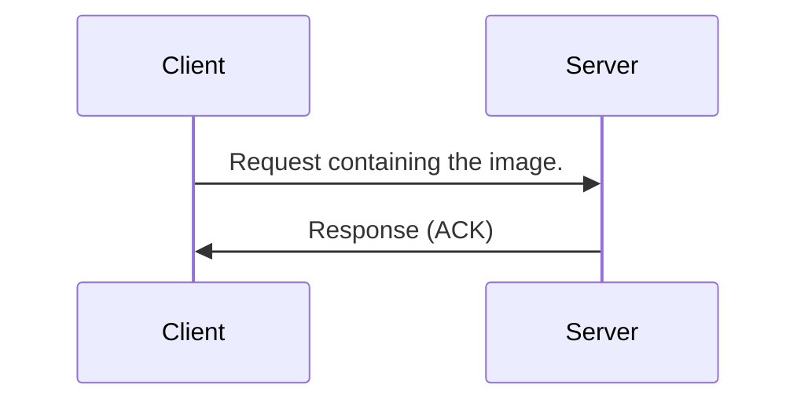
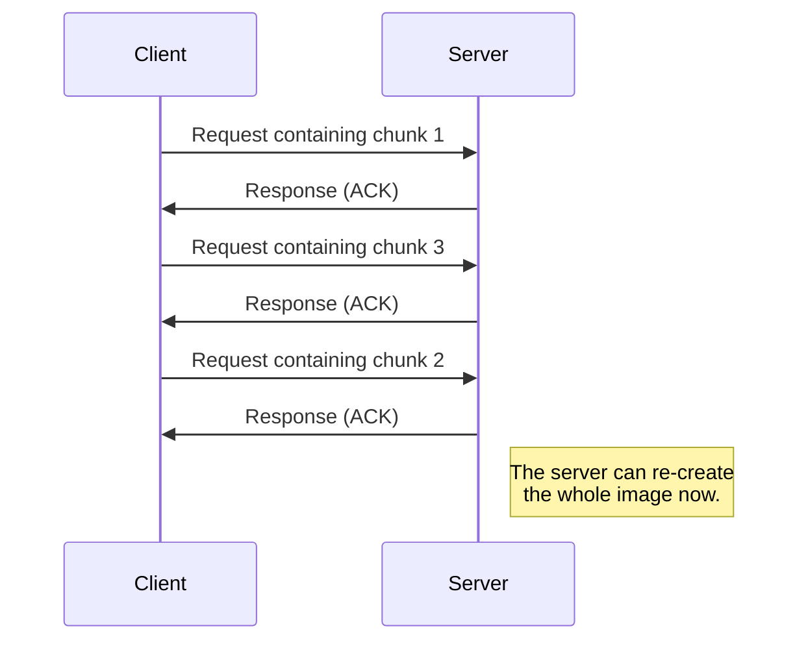
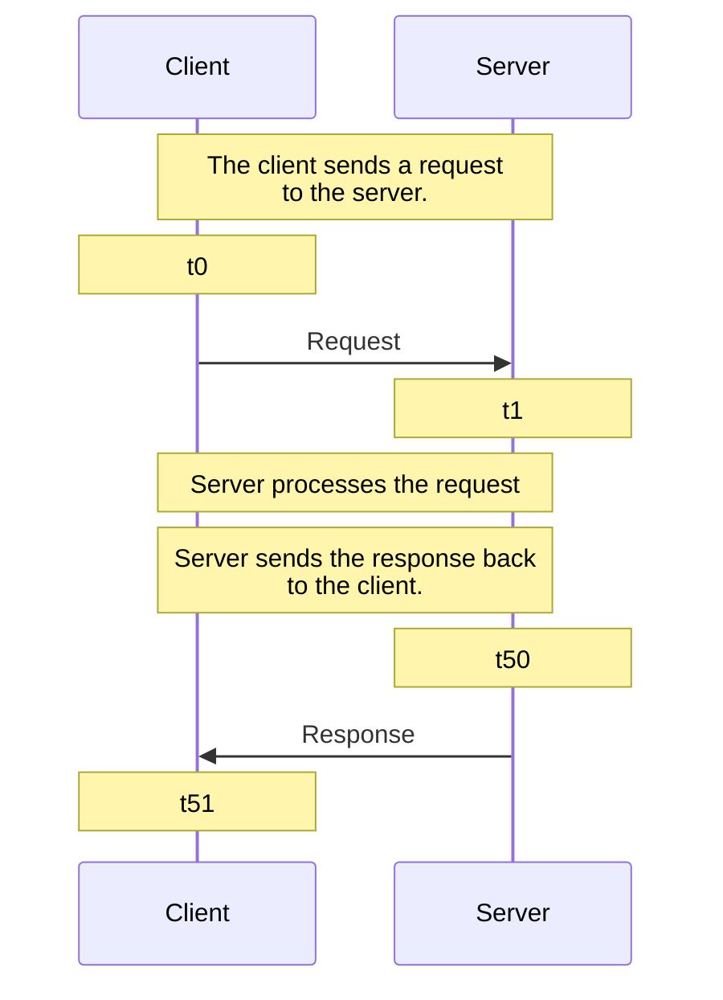
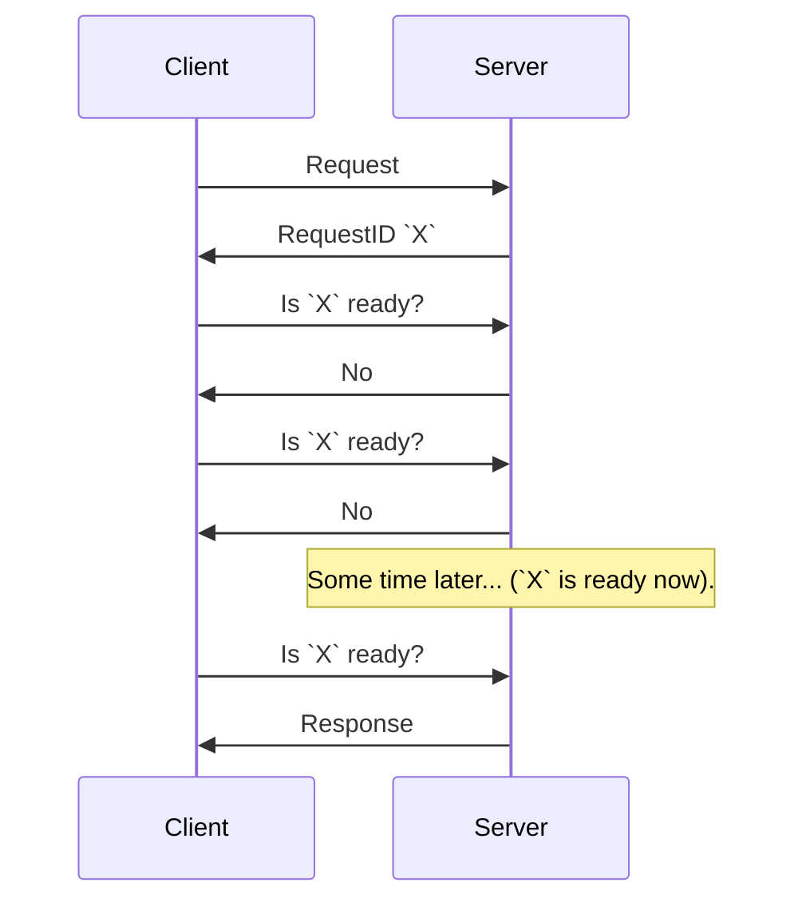
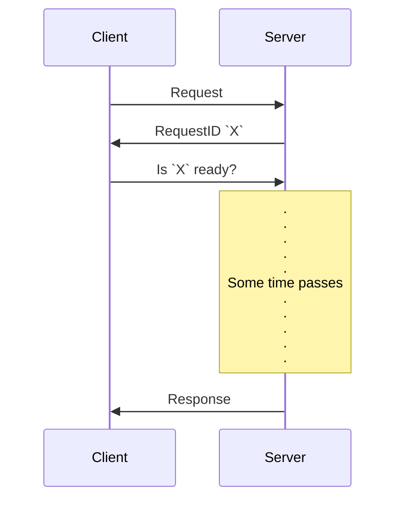

# Backend Engineering Notes

## Contents

- [Backend Engineering Notes](#backend-engineering-notes)
  - [Contents](#contents)
  - [(Some) Backend Communication Design Patterns](#some-backend-communication-design-patterns)
    - [Request Response Model](#request-response-model)
      - [Anatomy of Request/Response](#anatomy-of-requestresponse)
      - [Usecase: Building an Upload Image Service with Request Response](#usecase-building-an-upload-image-service-with-request-response)
      - [This Model Doesn't Work Everywhere!](#this-model-doesnt-work-everywhere)
      - [Summary](#summary)
    - [Synchronous vs Asynchronous Workloads](#synchronous-vs-asynchronous-workloads)
      - [Synchronous I/O](#synchronous-io)
      - [Asynchronous I/O](#asynchronous-io)
      - [Synchronous vs Asynchronous in Request Response](#synchronous-vs-asynchronous-in-request-response)
      - [Real Life Examples](#real-life-examples)
    - [Push](#push)
      - [Advantages and Disadvantages](#advantages-and-disadvantages)
    - [Short Polling](#short-polling)
      - [Advantages and Disadvantages](#advantages-and-disadvantages-1)
    - [Long Polling](#long-polling)

## (Some) Backend Communication Design Patterns

### Request Response Model

This is the most common backend design pattern.

The basic outline is:

1. Client sends a request to the server.
2. Server parses the request.
3. Server processes the request.
4. Server sends a response.
5. Client parses the response and consumes it.



This model is used all across the web. Protocols such as HTTP, DNS and SSH are based on it. RPC (remote procedure call) uses this model. SQL is written keeping the request response model in mind. APIs (REST, SOAP, GraphQL) are based on this model.

#### Anatomy of Request/Response

A request structure is defined, and agreed upon by both the client and the server.

A request has a clear boundary (where the bit stream corresponding to the request begins, and where it ends).

Clearly, a request is defined by a protocol and a message format.

A possible structure is an HTTP `GET` request:

```
GET / HTTP/1.1
Headers
<CRLF>
BODY
```

This will be determined when the client and the server decide upon a protocol to use. The request body will be parsed by some library, such as the `http` package available in multiple languages.

Same applies to the response.

#### Usecase: Building an Upload Image Service with Request Response

We have various ways of creating a service that can allow clients to upload images:

1. Client sends a large request with the image. This is simple, but in case the connection fails in between, all previous sent data will be lost.



2. Client divides the image into different chunks, and then sends each chunk in a different request. This allows for resumable sending of image (i.e., server can request specific chunks instead of the whole image in case the connection failed).



#### This Model Doesn't Work Everywhere!

Although the request response model is a popularly used model, some cases exist where use of this model would not produce optimal results.

1. Notification service (e.g., is there any new sale?)
2. Chatting application (e.g., are there new messages?)

In both of these, the server cannot send a 'response' unless the client requests the server for it. A way of building a chatting application using this model might require the client to poll a server repeatedly to check if there are any new messages. This will place a lot of unnecessary (empty) requests on the network. Therefore, this method doesn't scale well.

3. Very long running requests (e.g., query a billion rows in a DB)

Such requests can be handled via this model, but the client will have to wait for a long time before the response arrives here. An asynchronous model might be better suited for this case.
Also, if the client disconnects while the request is running, upon reconnection the client might want to know the status of the request.

#### Summary

The basic method of operation is the following:



At time `t0`, the client has _finished_ serializing the request and flushing it to the network. At time `t1`, the server has parsed the request (not deserialized it yet; that will happen next).

Now, uptill time `t50` the server processes the request, generates the response, serializes it _and_ flushes it to the network.

The client receives the response at time `t51`.

### Synchronous vs Asynchronous Workloads

The basic idea is that whether extra useful work can be done while our system waits for some processing to be done.

#### Synchronous I/O

The caller sends a request and blocks.

The calling process's context is switched out of the CPU while the I/O operation takes place. The caller cannot execute any code meanwhile.

Once the receiver responds, the caller unblocks and execution can continue.

Effectively, the caller and the receiver are in sync.

As an example, consider that a program asks OS to read from the disk. The main thread of the program will be taken off the CPU while the disk is read. Once the read completes, the program can continue execution.

#### Asynchronous I/O

The caller sends a request.

The caller can continue to work until it gets a response.

The caller may follow one of the following:

1. Caller can check if the response is ready via `epoll`.
2. The receiver may call back when it is done via `io_uring`.
3. The caller can spin up a new thread, that blocks while the operation is going on.

> The core principle for new thread based async code execution is that once a task being done asynchronously is finished, call some callback function with the results.

The caller and the receiver are not necessarily in sync.

As an example, consider a program wants to read from a file. It creates a secondary thread. The secondary thread reads from disk. The OS blocks the secondary thread. The main thread is still running and executing code. Finally, the secondary thread finishes running, and calls back the main thread.

#### Synchronous vs Asynchronous in Request Response

Synchronicity is mainly a client side property.

Most modern client libraries (fetch, axios, etc.) are asynchronous.

A client may send an HTTP request and still continue to do work.

#### Real Life Examples

In synchronous communicaion, the caller waits for a response from the receiver. This is like asking something to someone in a meeting, face to face.

In contrast, in asynchronous communication, the response can come any time, and the receiver can do anything in the meantime. This is like emails.

We commonly use asynchronous programming in our apps. This involves the use of promises or futures and so on.

We can also have asynchronous backend processing. Say the client submits a request for a very long running request to the backend. From the client's perspective, it can go further asynchronously, while some secondary thread may wait for the backend to reply. However, from the backend's view, there is a pending request. The backend might, in such a scenario introduce queues into the picture. A long running request can be placed into an execution queue, and the client can be sent back an identifier, like a job id.
The client can save this job id, and can later ask the backend if that job has finished execution.

There is a concept of asynchronous commits in postgres. When a client commits, usually it is a synchronous commit, where the client is blocked while the WAL contents in the memory buffer are written to the disk. Once that is done, the client is unblocked and also a successful commit is displayed. However, in asynchronous commits, the moment the WAL memory buffer begins the flush to disk (i.e., not flushed yet; we just started the process), the client is displayed a successful commit message. _This is a dangerous way of commits, as if the system crashed but the WAL was not fully flushed, we would lose our data, even though the transaction seemed committed to us._

As before, we have asynchronous IO in linux, via `epoll` and `io_uring`.

We even have asynchronous replication. When we perform replication, our main goal is to have 1 DB server to allow for writes, and multiple ones to allow for reads. Say a client did some updates at the primary (writer) DB server. Now, when the client commits its transaction, it will issue a commit command. The writer may now issue the commit first to each replica, and only on getting the commit reply from each, would it reply to the client that the commit has taken place. This takes time and the client would be blocked for a long time.
In contrast, we may have configured that transaction (or _every_ transaction, by default) to perform commits via async replication. This way, when the client commits, only the primary DB replica commits (note that this commit may also be asyncronous, as described above) and replies to the client that the commit has occurred. The comitted changes can then spread throughout the other replicas gradually. (This comes at a cost of eventual consistency).

We also have async OS cache, i.e., any disk writes are written to an OS cache, before going to the disk. This is disabled in databases, and writes go directly to the disk via `fsync`.

### Push

This is implemented when the response is needed as fast as possible.

One possible use case is a chatting app. The client needs to connect to the chat server, but then all messages are sent by the server without any client request.

The basic flow is:

1. Client connects to a server. (_note that here, the client is opening a connection, not sending any request._)
2. Server sends data to the client.
3. No request is needed from the client side.
4. This protocol typically must be bi-directional.

This is used by RabbitMQ.

#### Advantages and Disadvantages

A major advantage is that this is real time. The moment something happens, a message can be sent.

There are a few disadvantages as well:

1. Clients must be online for this to work.
2. Clients might not be able to handle huge amounts of data being pushed.
3. Requires a bi-directional protocol.
4. Polling is preferred for lighter clients.

### Short Polling

> When someone says 'polling', they usually mean short polling.

This is popular with the asynchronous style of programming.

The basic flow is:

1. Client sends a request.
2. Server immediately responds with a handle (unique ID).
3. Server may continue to process the request, or perhaps pick it up later, after persisting it in disk.
4. Client uses the handle to check for the status of the request.
   1. This is done by multiple 'short' request-response pairs as the polls.



#### Advantages and Disadvantages

The main advantages are that this is a simple model. It is good for long running requests, to facilitate asynchronous execution. It may also be built to allow for a client to disconnect, so that the server may persist the response for the client's handle, and send it sometime later when the client re-connects and asks for it.

The disadvantages are that this is _too chatty_, especially as we scale and add more clients. There are lots of requests and responses going around on the network, and most of them would be a `not yet complete` type of response. Another issue is that high amount of network bandwidth is used up server side. On a cloud deployment, this means costlier bills. This also wastes backend resources.

### Long Polling

> This is used by Apache Kafka

The basic idea is:

1. Client sends a request.
2. Server responds immediately with a handle.
3. Server continues to process the request.
4. Client uses the handle to check for the status.
5. Server _does not_ respond until it has the response.

The crux is that we have a handle, and we can disconnect until later (when we do ask for the status). This decreases the number of requests on the network.

Some variations have timeouts as well.




