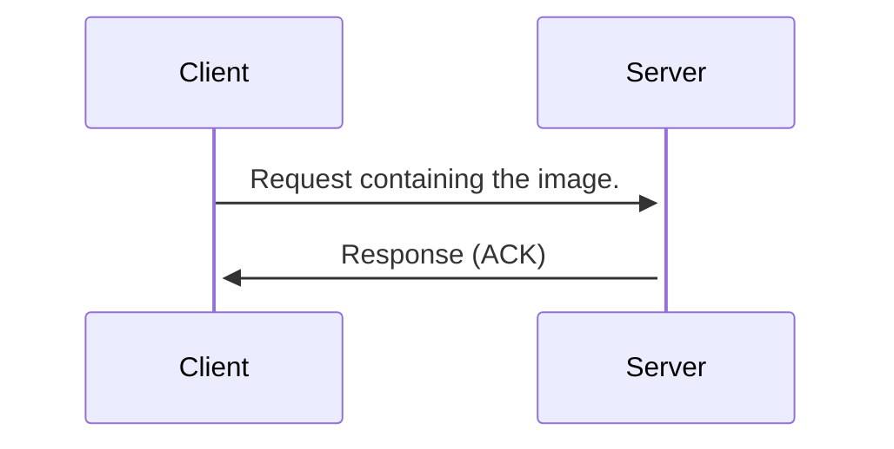

# Backend Engineering Notes

## Contents

- [Backend Engineering Notes](#backend-engineering-notes)
  - [Contents](#contents)
  - [(Some) Backend Communication Design Patterns](#some-backend-communication-design-patterns)
    - [Request Response Model](#request-response-model)
      - [Anatomy of Request/Response](#anatomy-of-requestresponse)
      - [Usecase: Building an Upload Image Service with Request Response](#usecase-building-an-upload-image-service-with-request-response)

## (Some) Backend Communication Design Patterns

### Request Response Model

This is the most common backend design pattern.

The basic outline is:

1. Client sends a request to the server.
2. Server parses the request.
3. Server processes the request.
4. Server sends a response.
5. Client parses the response and consumes it.


This model is used all across the web. Protocols such as HTTP, DNS and SSH are based on it. RPC (remote procedure call) uses this model. SQL is written keeping the request response model in mind. APIs (REST, SOAP, GraphQL) are based on this model.

#### Anatomy of Request/Response

A request structure is defined, and agreed upon by both the client and the server.

A request has a clear boundary (where the bit stream corresponding to the request begins, and where it ends).

Clearly, a request is defined by a protocol and a message format.

A possible structure is an HTTP `GET` request:

```
GET / HTTP/1.1
Headers
<CRLF>
BODY
```

This will be determined when the client and the server decide upon a protocol to use. The request body will be parsed by some library, such as the `http` package available in multiple languages.

Same applies to the response.

#### Usecase: Building an Upload Image Service with Request Response

We have various ways of creating a service that can allow clients to upload images:

1. Client sends a large request with the image. This is simple, but in case the connection fails in between, all previous sent data will be lost.



2. 